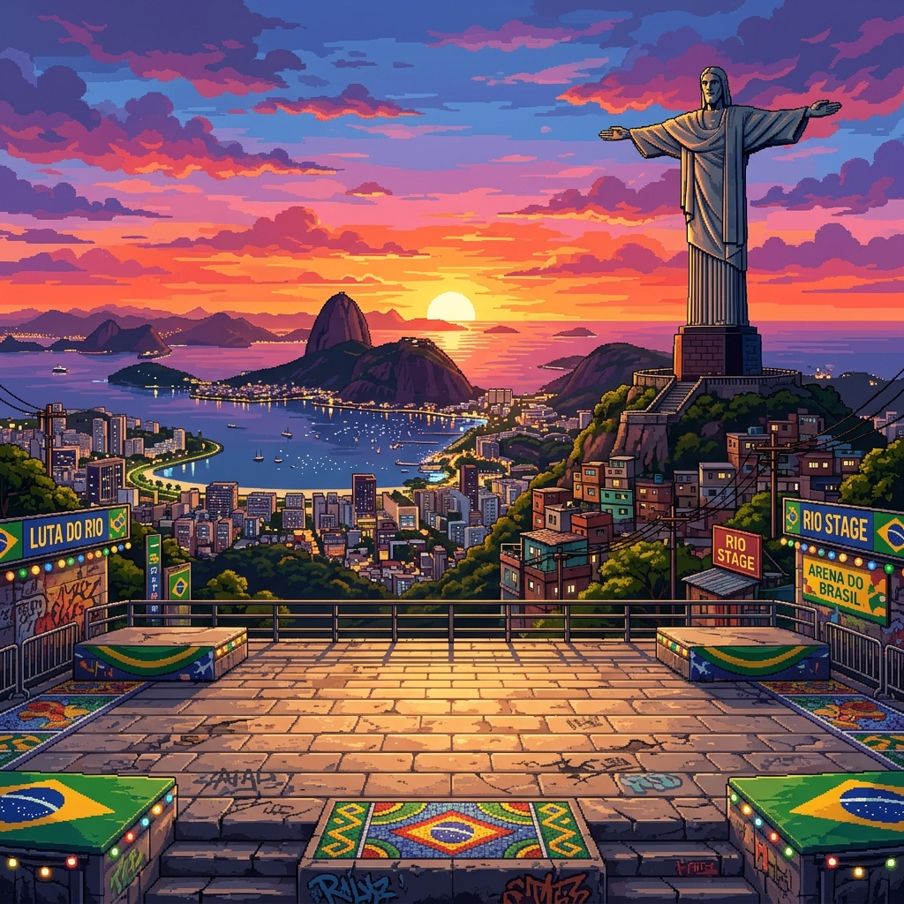

# 🇧🇷 Meme Fighter: Brazil Edition

Um jogo de luta estilo Street Fighter com os memes mais icônicos do Brasil. Desenvolvido para o portfólio do GitHub usando HTML5 Canvas, CSS moderno e JavaScript puro.

## 🎮 Como Jogar

1. Abra o `index.html` em seu navegador.
2. Pressione **ESPAÇO** para iniciar.
3. Controles:
    - **Jogador 1**: 
        - `A` / `D`: Mover
        - `W`: Pular
        - `F`: Soco/Ataque
    - **Jogador 2**:
        - `Setas`: Mover
        - `Seta para Cima`: Pular
        - `J`: Soco/Ataque

## 🚀 Tecnologias

- **HTML5 Canvas**: Renderização do jogo em tempo real.
- **Vanilla JavaScript**: Lógica de física, colisões e estados.
- **CSS3**: UI responsiva com estética retro-arcade.
- **Google Fonts**: Tipografia temática (Press Start 2P).

## 🛠️ Próximos Passos

- [ ] Adicionar mais personagens (Galo Cego, Nego Bam, etc).
- [ ] Implementar ataques especiais (Hadouken de Capivara).
- [ ] Sons de memes clássicos.
- [ ] Modo Single Player com IA.

## 📄 Licença

Este projeto está sob a licença MIT. Sinta-se à vontade para usar e modificar!
